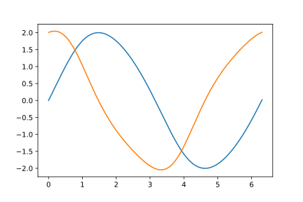
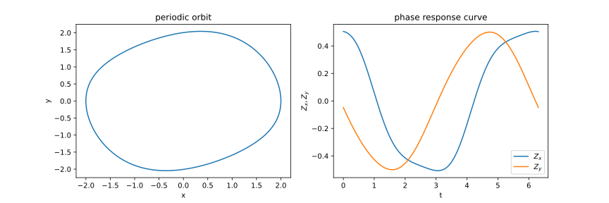
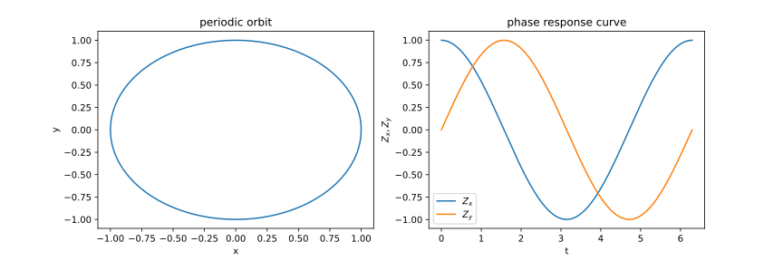
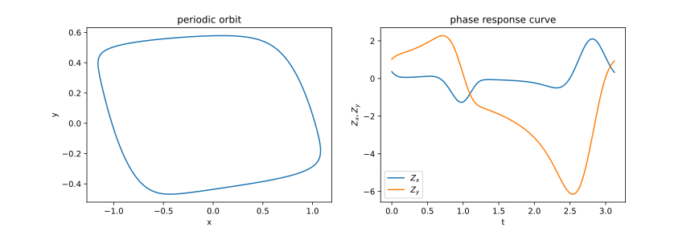
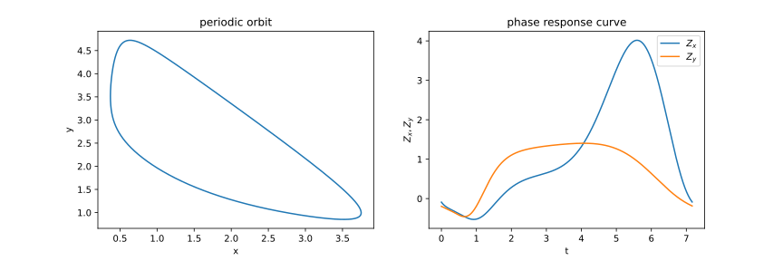
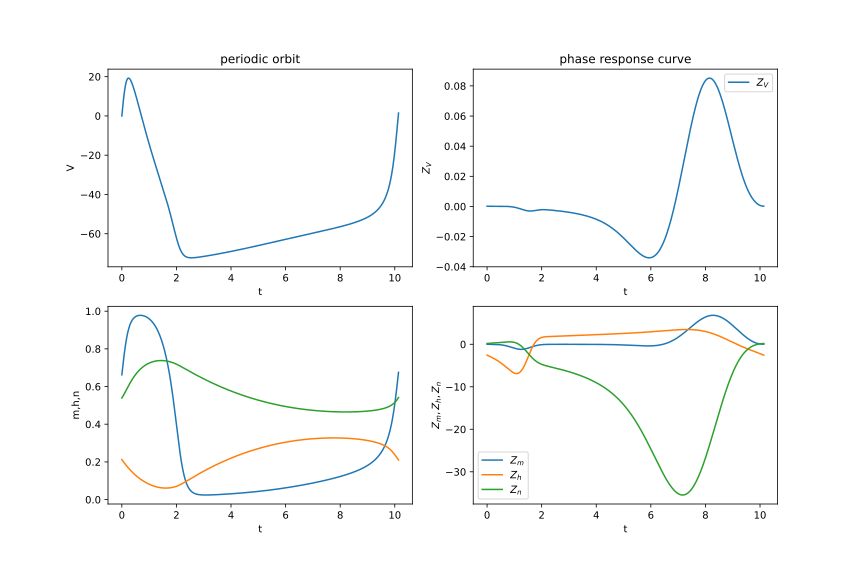

# prax
[](https://prax.readthedocs.io/en/latest/?badge=latest)
[](https://prax.readthedocs.io/)

JAX implementation of phase response curve

## Installation
`prax` is created based on `jax`, and please install `jax` at first. See [JAX](https://github.com/google/jax) page for installation.

After the installation of `jax`, `prax` can be installed with pip directly from GitHub, with the following command:
```
pip install git+https://github.com/yonesuke/prax.git
```

## Quickstart
We give an example on how to use this package with [Van der Pol oscillator](https://en.wikipedia.org/wiki/Van_der_Pol_oscillator).

First, import packages:
```python
import jax.numpy as jnp
from prax import Oscillator
from jax.config import config; config.update("jax_enable_x64", True)

import matplotlib.pyplot as plt
```

Create an oscillator class by inheriting `Oscillator` class:
```python
class VanderPol(Oscillator):
    def __init__(self, mu, dt=0.01, eps=10**-5):
        super().__init__(n_dim=2, dt=dt, eps=eps)
        self.mu = mu

    def forward(self, state):
        x, y = state
        vx = y
        vy = self.mu * (1.0 - x*x) * y - x
        return jnp.array([vx, vy])

model = VanderPol(mu=0.2)
```

Find periodic orbit (choose `init_val` nicely so that it goes to periodic orbit):
```python
init_val = jnp.array([0.1, 0.2])
model.find_periodic_orbit(init_val)
print(model.period) # 6.3088767
plt.plot(model.ts, model.periodic_orbit)
```


Calculate phase response curve:
```python
model.calc_phase_response()
plt.plot(model.ts, model.phase_response_curve)
```


## Galleries
See [examples](examples/) directory!!

- Van der Pol equation [[code](examples/vanderpol.py)]
    ```python
    class VanderPol(Oscillator):
        def __init__(self, mu, dt=0.01, eps=10**-5):
            super().__init__(n_dim=2, dt=dt, eps=eps)
            self.mu = mu

        def forward(self, state):
            x, y = state
            vx = y
            vy = self.mu * (1.0 - x*x) * y - x
            return jnp.array([vx, vy])

    model = VanderPol(mu=0.2)
    ```
    

- Stuart Landau equation [[code](examples/stuartlandau.py)]
    ```python
    class StuartLandau(Oscillator):
        def __init__(self, dt=0.01, eps=10**-5):
            super().__init__(n_dim=2, dt=dt, eps=eps)

        def forward(self, state):
            x, y = state
            vx = x - y - x * (x * x + y * y)
            vy = x + y - y * (x * x + y * y)
            return jnp.array([vx, vy])

    model = StuartLandau()
    ```
    

- FitzHugh-Nagumo equation [[code](examples/fitzhughnagumo.py)]
    ```python
    class FitzHughNagumo(Oscillator):
        def __init__(self, params, dt=0.01, eps=10**-5):
            super().__init__(n_dim=2, dt=dt, eps=eps)
            self.a, self.b, self.c = params

        def forward(self, state):
            x, y = state
            vx = self.c * (x - x ** 3 - y)
            vy = x - self.b * y + self.a
            return jnp.array([vx, vy])

    model = FitzHughNagumo(params=[0.2, 0.5, 10.0])
    ```
    

- Brusselator equation [[code](examples/brusselator.py)]
    ```python
    class Brusselator(Oscillator):
        def __init__(self, params, dt=0.01, eps=10**-5):
            super().__init__(n_dim=2, dt=dt, eps=eps)
            self.a, self.b = params

        def forward(self, state):
            x, y = state
            vx = self.a - (self.b + 1.0) * x + x * x * y
            vy = self.b * x - x * x * y
            return jnp.array([vx, vy])

    model = Brusselator(params=[1.0, 3.0])
    ```
    

- Hodgkin Huxley equation [[code](examples/hodgkinhuxley.py)]
    ```python
    class HodgkinHuxley(Oscillator):
        def __init__(self, input_current, C=1.0, G_Na=120.0, G_K=36.0, G_L=0.3, E_Na=50.0, E_K=-77.0, E_L=-54.4, dt=0.01, eps=10**-5):
            super().__init__(n_dim=4, dt=dt, eps=eps)
            self.input_current = input_current
            self.C = C
            self.G_Na = G_Na
            self.G_K = G_K
            self.G_L = G_L
            self.E_Na = E_Na
            self.E_K = E_K
            self.E_L = E_L

        def alpha_m(self, V):
            return 0.1*(V+40.0)/(1.0 - jnp.exp(-(V+40.0) / 10.0))
        
        def beta_m(self, V):
            return 4.0*jnp.exp(-(V+65.0) / 18.0)
        
        def alpha_h(self, V):
            return 0.07*jnp.exp(-(V+65.0) / 20.0)
        
        def beta_h(self, V):
            return 1.0/(1.0 + jnp.exp(-(V+35.0) / 10.0))
        
        def alpha_n(self, V):
            return 0.01*(V+55.0)/(1.0 - jnp.exp(-(V+55.0) / 10.0))
        
        def beta_n(self, V):
            return 0.125*jnp.exp(-(V+65) / 80.0)

        def forward(self, state):
            V, m, h, n = state
            dVdt = self.G_Na * (m ** 3) * h * (self.E_Na - V) + self.G_K * (n ** 4) * (self.E_K - V) + self.G_L * (self.E_L - V) + self.input_current
            dVdt /= self.C
            dmdt = self.alpha_m(V) * (1.0 - m) - self.beta_m(V) * m
            dhdt = self.alpha_h(V) * (1.0 - h) - self.beta_h(V) * h
            dndt = self.alpha_n(V) * (1.0 - n) - self.beta_n(V) * n
            return jnp.array([dVdt, dmdt, dhdt, dndt])

    model = HodgkinHuxley(input_current=30.0)
    ```
    
