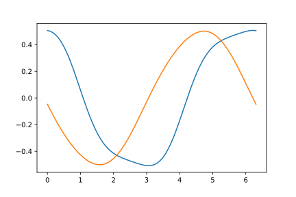

# prax
JAX implementation of phase response curve

## Installation
`prax` can be installed with pip directly from GitHub, with the following command:
```
pip install git+https://github.com/yonesuke/prax.git
```

## Quickstart
We give an example on how to use this package with [Van der Pol oscillator](https://en.wikipedia.org/wiki/Van_der_Pol_oscillator).

First, import packages:
```python
import jax.numpy as jnp
from prax import Oscillator
from jax.config import config; config.update("jax_enable_x64", True)

import matplotlib.pyplot as plt
```

Create an oscillator class by inheriting `Oscillator` class:
```python
class VanderPol(Oscillator):
    def __init__(self, mu, dt=0.01, eps=10**-5):
        super().__init__(n_dim=2, dt=dt, eps=eps)
        self.mu = mu

    def forward(self, state):
        x, y = state
        vx = y
        vy = self.mu * (1.0 - x*x) * y - x
        return jnp.array([vx, vy])

model = VanderPol(mu=0.2)
```

Find periodic orbit (choose `init_val` nicely so that it goes to periodic orbit):
```python
init_val = jnp.array([0.1, 0.2])
model.find_periodic_orbit(init_val)
print(model.period) # 6.3088767
plt.plot(model.ts, model.periodic_orbit)
```


Calculate phase response curve:
```python
model.calc_phase_response()
plt.plot(model.ts, model.phase_response_curve)
```
